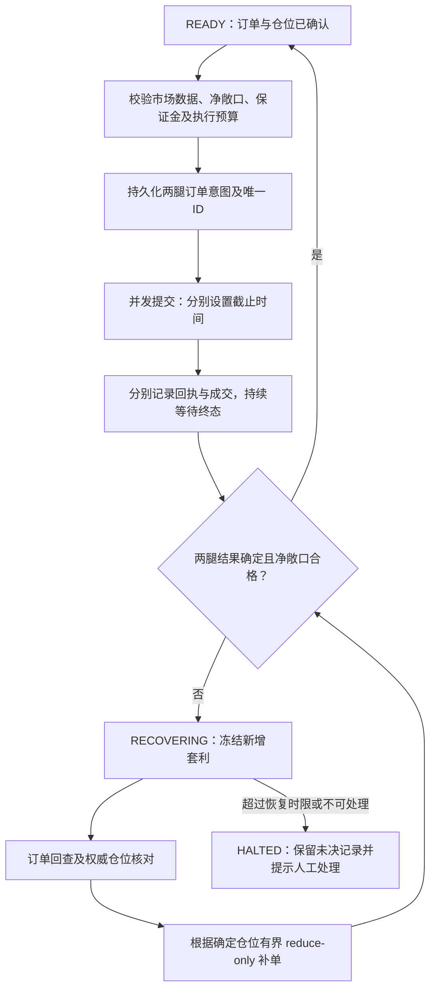

# Entropy–Robinhood–Lighter 全仓库代码审核

## 范围与结论

- 仓库：<https://github.com/w343153618/Entropy-Robinhood-Lighter-Arbitrage>
- 基线：`main`，`b0f02e9e116624e603273c9a52db5cdef559e571`（提交时间 2026-08-29 22:31:13 +0800）。
- 审核日期：2026-09-26；按当前提交做全仓库审核，无 PR 或增量 diff。
- 行为契约：README.md、config.example.yaml；未发现单独的 issue spec、AGENTS.md 或 CONTRIBUTING.md。因此 Standards 轴关注工程契约，Spec 轴关注交易流程是否符合 README。
- 阅读了入口、配置、策略、盘口、两个适配器、行情 feeds、录制、分析、展示及现有测试；交易适配器和策略恢复由独立代理交叉审核。
- 业务源码没有修改；新增文件仅为本报告、离线复现脚本和结果。

**结论：正常行情下的策略框架已具备基础功能，但订单未知结果、恢复状态和停止流程没有完整闭环。建议先修复下面的 P1，再扩大实盘规模或提高发单频率。**

已实现的有价值基础包括：官方盘口、按深度而非只看买一卖一的信号、数量共同精度、并发两腿、position caps、inventory surcharge、IOC、补单 reduce-only、定期对账及录制。问题主要发生在故障与成交状态转换边界。

优先级：P1 为应优先修复的交易风险；P2 为可靠性、风险预算或数据正确性问题；P3 为较低影响问题。没有发现可无条件证明的 P0。两轴分别列出，工程问题不用于抵消交易问题。

## 验证结果与边界

1. 隔离环境：Python 3.13.15，项目基础 requirements、pytest 9.1.1、ruff 0.16.9；没有安装或运行签名 SDK。
2. `python -m pytest tests/ -q`：**48 passed**。
3. `ruff check entropy_robinhood_lighter_arbitrage tests main.py tools`：**All checks passed**。
4. `review/offline_repro.py`：13 个场景使用真实项目函数和假场所/假传输/临时 CSV 验证；不是交易所集成测试。脚本断言记录当前缺陷，修复后对应断言应更新为正确行为。
5. SDK 和协议比对使用审核当日的官方文档及 SDK main 源码；项目没有锁定 Lighter 提交，因此该比对不代表用户已有安装版本，也不保证未来版本。
6. 未加载用户 `.env`，未使用真实凭证，未连接交易账户，未下单。未验证真实时延、实际费率、账户权益、成交质量、故障恢复或策略收益。浅克隆未审核完整 Git 历史，也未执行完整依赖漏洞扫描。

复现命令（已安装基础依赖的 Python 3.11+）：

```bash
python review/offline_repro.py
```

本次使用的解释器：`/private/tmp/entropy-review-b0f02e9/bin/python`。结果保存在 `review/offline-results.jsonl`。临时环境不应当作生产运行环境。

## Spec：交易与恢复流程

### S01 · P1 · 未知成交结果没有阻止继续开仓

**位置：** `engine.py:347–351`，关联 `582–588`、`643–655`。

任一腿 `unresolved=True` 时，执行任务释放 venue locks 后仅设置 `_reconcile_evt`，然后唤醒策略。`_scan()` 没有未知订单/待恢复状态检查。对账事件只等 1 秒，但最近交易有 5 秒 grace，第一轮对账跳过仓位读取；事件已清除，默认再等 15 秒才重试。持续交易还能继续推迟安全读取。

**证据：** 两腿都返回 timeout/unknown，local positions 仍为 0；即时对账读取次数 `[0, 0]`；更新盘口后仍能生成新的套利计划，`halted=False`。

**影响：** 未知链上成交没有计入本地仓位，净额和可用上限可能失真，新双腿继续叠加。README 207–209 承诺的自动对冲与对账缺少恢复完成的门槛。

**建议：** 按 pair 维护 `RECOVERING` 状态与 unresolved order IDs；出现未知结果立刻停止新增套利。订单终态、权威仓位及净敞口全部核对后才返回 `READY`。grace 跳过必须预约到期补读，不能把事件当已完成。单次 REST 仓位快照不足以证明所有延迟订单已终结。

### S02 · P1 · Lighter 提交后的网络异常被当成确定未成交

**位置：** `venue_lighter.py:291–298`，关联订单流 `67–89`。

`create_order()` 包含发送交易；服务端可能已接受或成交，客户端才发生超时、连接重置或响应错误。当前异常处理直接 unwatch，并返回 `filled_base=0`、`unresolved=False`。另一腿成交后，engine 会按错误的零成交假设对冲；迟到成交仅留在 `_terminal` 缓存。

**证据：** 假 SDK 先记录订单已接受，再抛 TimeoutError；函数返回确定失败、0 成交。随后订单流报告成交 1，pending watcher 为 0，engine 没有收到更新。

**建议：** 区分签名前失败、明确拒绝、提交结果未知。网络错误保留订单身份，进入 unknown，继续按 WS/订单/交易回查；迟到事件必须按 ID 去重进入成交台账。[官方 SDK 的 create_order/send_tx 实现](https://raw.githubusercontent.com/elliottech/lighter-python/main/lighter/signer_client.py)

### S03 · P1 · Lighter nonce 连续性检查漏掉单步缺口

**位置：** `feeds.py:76–90`，核心为第 77 行。

官方协议要求当前 `begin_nonce` 与上一帧 `nonce` 相等。当前仅检查 `begin > prev + 1`，所以 `prev=10`、`begin=11` 被接受，旧/倒序帧也可能被应用。[Lighter 官方 WebSocket 文档](https://apidocs.lighter.xyz/docs/websocket-reference#order-book)

**证据：** 快照 10 有买价 100；丢失 10→11 删除 100 的 diff；收到 11→12 新增买价 99。结果仍 `best_bid=100`、fresh=True，重新订阅次数为 0。

**影响：** 幽灵价位成为可成交深度，另一腿可能成交，而本腿 IOC 失败。

**建议：** 按协议严格校验连续性，明确处理重复/倒序/缺失 nonce；无法证明一致性时清书并重取快照。增加 `prev+1` 边界测试；现有 gap 测试只覆盖更大的缺口。

### S04 · P1 · Lighter 提交阶段没有项目级截止时间

**位置：** `venue_lighter.py:279–290`，对照第 312 行；`engine.py:429–432`。

`settle_timeout` 只约束提交成功后的 WS future，不能约束 `await signer.create_order()`。两腿 gather 等待期间持有两边 venue locks；已成交的一腿也要等另一腿返回后才能更新本地仓位和开始补单。审核时官方 SDK REST 默认超时为 5 分钟；这不是本次测出的用户实际网络时延。[官方 REST 超时实现](https://raw.githubusercontent.com/elliottech/lighter-python/main/lighter/rest.py)

**证据：** 假 transport 一直不返回，配置结算超时 0.02 秒，0.05 秒后订单任务仍 pending。

**建议：** 设置独立提交 deadline 和整体订单生命周期 deadline。超时进入 S02 的 unknown 分支，不视作零成交。两腿分别记录已确认结果；未知另一腿仍应冻结 pair，并在权威确认后决定补单，避免盲目对冲。

### S05 · P1 · 停机可关闭尚未结算订单的连接

**位置：** `engine.py:207–217`。

`asyncio.wait(..., timeout=settle_timeout + 2)` 后不检查 pending，直接取消后台任务和关闭适配器。HL POST 允许 10 秒，其后还可能 orderStatus 轮询及 hedge；Lighter 的提交阶段更可能超过该预算。此外 reconcile 循环里的 hedge 没有进入 `_exec_tasks`，取消 reconcile 会直接打断其结算。

**证据：** 用真实 `_run_inner()` 和假场所，订单已开始后停止；2.01 秒预算后两个 adapter 均已 close，但仍有 1 个执行任务未完成。复现最后主动完成假订单，没有留下 pending 测试任务。

**建议：** 统一追踪正常单和恢复单。停机先关闭新增交易，再将所有订单推进至终态；不能确认的订单持久化为 pending 并明确提示恢复要求，然后再关闭传输。重启必须先回查这些 ID。停机不必自动平掉所有已匹配仓位，但必须保证未决结果可追踪。

### S06 · P1 · 下单滑点预算可吞掉策略价差

**位置：** `engine.py:424–426`；示例 `config.example.yaml:29–31,65`。

示例单侧阈值 4 bps，但执行允许每腿 50 bps 的不利滑点，数量和盈利判断仍依据原盘口。两腿即使全额成交，也可能在合规限价内把正价差变为负价差；不能据此保证 README 68–71 所说的完整往返最少收益。

**证据：** 1 单位计划买 100、卖 100.04，预期价差 +0.04；合法下单价格边界为买 100.5、卖 99.5398；假成交在边界处完成后实际价差为 **−0.9602**（费用为零）。这是允许价格的反例，不表示实盘每次都会在最差价格成交。

**建议：** 常规套利执行联合约束两腿允许价格、手续费和收益预算；较宽紧急平衡滑点单独管理。若策略允许负的单次 edge，应按持仓开平周期预算，而不是简单要求每次 crossing 都为正。README 的收益下界应明确理想成交前提，并报告实际滑点、补单和持有成本。

### S07 · P2 · 深度定量可能越过订单和仓位上限

**位置：** `book.py:176–181`，关联 `engine.py:395–399`、`258–261`。

`cap_notional / asks[0][0]` 用买一价格换算数量，随后 walk_depth 的多档真实买入金额可以更大。Engine 发现 headroom 不足时再用相同算法规划，仍可能越限，且没有复核；两 venue 的 headroom 共用一个参考价。

**证据：** 买盘可买 0.5 单位@100，下一档 110；对手可卖@120；每单和每 venue 上限均 100。`_scan()` 仍返回 qty=1、buy notional=105、sell notional=120。

**建议：** 在累积深度时同时约束两腿真实金额及各自执行后仓位，以更保守的标记/允许价格做最后校验。最终计划不得超过上限；补单和风险降低订单的预算例外需明确区分。

### S08 · P2 · 对冲部分成交没有立即重算与进入恢复

**位置：** `engine.py:552–566`。

正常响应的 hedge 即使部分成交也会更新一次仓位后直接 return，没有重新检查净额、设置 reconcile 或禁止新套利。

**证据：** 初始仓位 +3/−1，补卖 2 仅成交 1，剩余 net=+1，而 tolerance=.001；仅发一次补单、未触发 reconcile，更新盘口后仍可新套利。

**建议：** 每次补单后重算 net，处于恢复状态时依据最新盘口有界重试。完成条件区分可接受净额、dust、场所故障和需要人工处理；增加按 USD 计算的净敞口和持续时间限额。

### S09 · P2 · Hyperliquid 连接存活被当成盘口新鲜

**位置：** `feeds.py:144–149`；`book.py:76–78`。

所有收到的帧都会 `touch()`，fresh 只看 alive_ts。特定 coin 的盘口订阅停止更新，而 pong 继续时，历史价格仍可用于交易。HL l2Book 是定期快照流，连接健康不能代替市场数据健康。[Hyperliquid 官方订阅文档](https://hyperliquid.gitbook.io/hyperliquid-docs/for-developers/api/websocket/subscriptions)

**证据：** t=100 最后盘口，t=1000 只有 pong，900 秒旧盘口仍被 10 秒 freshness 条件判为 fresh。

**建议：** 分开 connection_alive、book_updated 和 server_timestamp；HL 按匹配 coin 的有效快照年龄判断。Lighter 仅发送变化，不能简单照搬 HL 时间规则，需为静默行情加快照校验。

## Standards：工程、配置及录制分析流程

### E01 · P2 · 不同市场的数据混入同一个阈值分析

**位置：** `recorder.py:22–29,111–117`；`tools/analyze.py:48–54`。

默认所有 symbol/hedge/deployment 追加到同一 `logs/minutes.csv`，CSV 没有市场身份；analyzer 不能识别或过滤。更换标的或对冲 venue 后，旧数据仍参与新配置建议。

**证据：** 两个 Recorder 写入分别 0 和 1000 bps 的分钟记录，各 60 samples。分析得到 median=500 bps，没有混市场提示。

**建议：** 每行保存 pair identity、quote、schema_version；默认按 pair 分文件。分析时指定市场并拒绝混合身份，保留缺样本和时间覆盖质量。

### E02 · P2 · 非有限配置数值能静默关闭对冲

**位置：** `config.py:223–225,350`；消费处 `engine.py:506–509`。

float 类型检查允许 YAML `.nan`/`.inf`；大部分上限、容忍值和 timeout 也缺区间约束。`abs(net) > nan` 永远为 False。

**证据：** 实际 load_config 接受 `net_tolerance_base: .nan`；真实 Engine 净仓为 1，`_hedge()` 调用次数为 0。配置复现 stub 掉 dotenv 和环境变量读取。

**建议：** 所有数值验证 `math.isfinite()`；cap、金额、timeout、send budget 必须合理为正，tolerance/slippage 校验有限区间和字段交叉关系；启动打印最终生效值。

### E03 · P2 · 声明的安装命令入口不存在

**位置：** `pyproject.toml:32–33`。

命令 `entropy-rh-arb` 指向 `entropy_robinhood_lighter_arbitrage.main:main`，但 main.py 只有仓库根目录版本，package 里不存在该模块。

**证据：** 从 pyproject 读取入口后 `find_spec()` 返回 None；这是源码/模块验证，没有假装已进行完整 wheel 安装测试。README 的 `python3 main.py` 不受这个入口问题影响。

**建议：** CLI 放到 package，根 main.py 作为薄包装；CI 加已安装命令的 `--help` smoke 和固定 SDK 的导入/接口检查。

### E04 · P3 · 取消录制任务会丢失最后一分钟

**位置：** `engine.py:207–215`；`recorder.py:133–138`。

Engine 收到 stop 后立即取消 recorder，循环后的 `_flush()` 没有 finally 保护。

**证据：** 复现同样停止顺序，已采样 1 条后取消，未写样本仍为 1，CSV 不存在。

**建议：** Recorder 用 try/finally 刷尾部样本，或先等其基于 stop 正常退出。验证 async run 的停止路径，而非只手动调用 `_flush()`。

## 建议的交易流程



状态名字是实现建议，不是要求引入复杂框架。关键不变量：**存在未知订单或超额净敞口时，不能继续新增风险；每一笔迟到成交必须且只能入账一次。**

## 优化顺序

### 第一阶段：闭合订单与恢复流程

1. S01/S02/S04/S05 一起修：订单身份、结果分类、截止时间、迟到事件、恢复门槛、停止/重启对账。
2. 修 S03 连续性和 S09 市场级 freshness。
3. 把部分补单、429、5xx、超时、WS 断开、重启未决单纳入离线故障测试；全部测试不需要真实账户。

### 第二阶段：使资金与收益预算真实生效

1. 修 S06/S07/S08 和 E02。
2. 新增净敞口 USD 上限、未对冲持续时间、可用保证金门槛；已有 position cap 不能替代这些指标。
3. 示例 `hedge.taker_fee_bps: 0.0` 会覆盖 tradexyz 的 1.0 配置默认，示例 persistence=0 也会关闭过滤。按 venue 拆默认值并清晰显示实际生效配置；实际费率需依据账户真实读数确认。
4. 收益统计同时呈现 actual fill slippage、补单损益、手续费、资金费及持仓时间；USDG/USDC 基差单独观察。现有 fillEdge 和 MTM 不是完整的策略净收益核算。

### 第三阶段：改进数据流程，再针对测量结果优化性能

1. 修 E01，记录指定金额的 VWAP edge、可成交量、信号持续时间及 pair/config identity。
2. analyzer 当前用分钟 edge 最大值估算机会频率，没有深度、持续性和库存轨迹，无法当作完整收益回测。添加离线事件回放，区分价差出现、满足条件、实际可执行和完整开平循环。
3. 增加行情→规划→提交→回执→终态→补单的延迟分位数、拒单率、partial fill 比例和最大裸敞口时间。先测瓶颈再改性能。
4. 可能的局部性能优化：同一 book version 缓存排序结果；交易 CSV 持久化异步批量写；保持现有连接复用。持久化订单意图不能为了性能跳过。
5. 锁定 Python/SDK 版本和 Lighter commit，CI 验证 CLI、接口契约及故障路径，保留可回滚依赖集合。

## 汇总

- **Spec：9 项，6×P1 + 3×P2；最严重类别为订单未知结果与恢复/停机闭环。**
- **Standards：4 项，3×P2 + 1×P3；最严重类别为数据身份丢失与无效风险配置被接受。**
- 优化应首先提高故障状态的可确认性，然后校验预算，最后根据真实测量提高吞吐。
