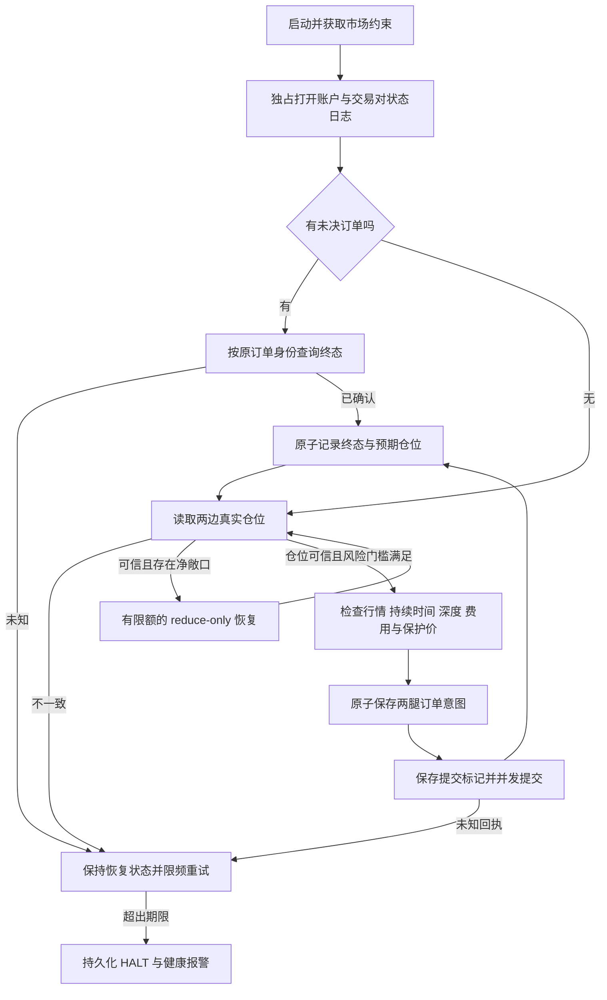

# 交易执行与长期运行加固记录

审查基线：`b0f02e9e116624e603273c9a52db5cdef559e571`。本报告在本地加固完成时写成；随后已于 2026-09-26 上传至[独立私有仓库](https://github.com/w343153618/Entropy-Robinhood-Lighter-Arbitrage-20260926-230453)，首次发布提交为 `e4efc3f44e61ae82fae210cd1302c81a145c6c43`。未部署服务或发送实盘订单。2026-09-27 更新发布与 CI 状态，逐项复核见 [版本复核记录](2026-09-27-peer-review-verification.md)。

## 结论与适用范围

原版本的主要问题集中在订单结果不确定时的控制、持久化恢复、仓位核对、单腿补偿和运行监督。已经对这些路径实际修改并增加回归测试。当前交付包含执行状态日志、恢复屏障、严格行情验证、运行风控、健康检查、部署模板和操作手册。

“长期无人值守”需要两种行为：有充分证据时自动恢复；证据不足或超过风险预算时停止新增敞口并报警。当前代码遵守这一边界。持久化 HALT 不会被重启清除，可能继续查询旧订单和减少已知净敞口。程序不承诺所有交易所故障均能自动恢复，也不承诺价差策略盈利。

## 执行流程

## 已处理的问题

| 环节 | 原故障或隐患 | 当前处理 |
| --- | --- | --- |
| 提交超时 | 交易所可能已接单，网络异常却被当作确定零成交 | 稳定 client ID；网络/5xx/缺字段均保持 unknown；提交期限与结算期限分开 |
| 进程重启 | 内存订单状态丢失；重启可能重复交易 | SQLite WAL、FULL 同步、账户/市场身份、独占进程锁；发送前保存两腿意图和提交标记 |
| 成交记账 | 终态与仓位分别保存会留下崩溃窗口 | 终态结果和预期仓位在同一个事务提交；重复终态不重复记仓，冲突终态拒绝 |
| 未决订单 | 查询不到就可能继续开仓 | 未知结果撤销仓位可信状态；原身份查询，不能用空仓或 not found 推断未成交 |
| 仓位核对 | 延迟 REST 仓位可能覆盖刚确认的成交 | 整个交易对加锁核对、结算宽限期；不一致时保留预期仓位并暂停，不用旧值覆盖 |
| 部分成交 | 一次补单仍未对齐就恢复套利 | 恢复循环继续处理部分成交；仅 reduce-only；按实际 venue 精度、最小单和可用路径选择 |
| 风险额度 | 普通交易耗尽全部发送额度，补单无额度 | 正常开仓预留两个恢复额度；恢复也受总限频和订单金额约束 |
| 小额残差 | 只看 base 容忍度会误放高价资产敞口 | 同时检查 base/USD；只有实际无法下单的残差才能使用有限 dust 预算 |
| 滑点与费用 | 信号门槛远小于两腿允许滑点 | 规划时预留两腿滑点；舍入后再次核验费用、门槛及订单保护价；非零中轴仍可能有负向门槛 |
| 多档深度 | 只用最优价估算名义金额或仓位 | 两腿实际深度金额均受限；按较坏可执行价格复核仓位；数量严格向下取整 |
| Lighter 行情 | nonce 连续性判断、缺帧或重连后的快照风险 | 严格区间连续性；缺口/重叠/畸形数据清空并重取；60 秒定期权威快照 |
| HL 行情 | pong 让旧盘口看起来新鲜 | 市场快照与连接心跳分别判断；校验服务端时间，过期/未来/畸形盘口不可交易 |
| SDK 边界 | 错误返回结构、非有限数、整数线宽等 | 明确终态 allowlist、实际 fills 核对、数值与精度/整数范围校验；缺失依据保持未知 |
| 账户风险 | 余额失效、重复统计保证金桶、重启清空回撤 | 使用实际交易 dex 权益桶；读取失败/过期暂停；权益峰值和 HALT 持久化 |
| 存储风险 | 磁盘不足、路径碰撞可能破坏状态 | 新增敞口前检查磁盘余量；保护 DB/WAL/SHM/lock、health 临时文件、日志与日文件、输入配置与凭证路径 |
| 退出 | 取消策略同时丢掉正在确认的订单 | 先停止开仓、保留账户 stream 排空；到期保留未决意图；监督器负责最终进程终止期限 |
| 后台任务 | 核心 task 死亡后主进程继续显示运行 | 监督行情、恢复、余额、策略、录制和健康任务；异常退出写 HALT 并关闭进程 |
| 健康状态 | 余额为零或开仓 gate 失败仍显示 READY | READY 必须实际满足开仓条件；输出 PAUSED/RECOVERING/HALTED 原因，过期快照失败 |
| 数据录制 | 混市场、最后一分钟丢失、写盘失败或无限积压 | schema/市场身份、UTC 日分片、取消时 flush、有限缓存、稳定 bar ID 重试去重；存储故障可观测 |
| 重启分钟 | 正常停止再启动会产生重叠分钟 | 分析器剔除整个重叠分钟并报告；不猜测或合并样本；相同 ID 内容冲突仍拒绝 |
| 运维入口 | 安装后找不到 CLI、无界日志、不明确实盘启动 | 包内入口与源码入口统一；显式 --live / --record-only / --check-config；文件轮转与部署模板 |
| 网络环境 | SOCKS 代理下 WebSocket 缺依赖，持续重连 | 补充 python-socks；在本机公开行情连接中复测成功 |
| 依赖安全 | 官方 SDK 的旧 urllib3 上限引入已知漏洞 | 固定源码哈希、可重复 wheel 构建；仅修正 METADATA/RECORD；SDK 代码和原生库保持不变；使用已检查的依赖锁 |

## 验证证据

最终完整测试 **193 项通过**；Ruff 与 `git diff --check` 通过。另在真实安全 SDK 可导入的环境中运行完整共享源码测试，仍为 **193 项通过**。本地 Python 为 3.13.15。首次发布提交的 [GitHub Actions 运行 36251137744](https://github.com/w343153618/Entropy-Robinhood-Lighter-Arbitrage-20260926-230453/actions/runs/36251137744) 已在 Ubuntu / Python 3.13 上成功完成：193 项测试、Ruff、wheel 构建、仓库外安装 CLI、离线配置校验、SDK 构建与无凭证导入。未在生产 Linux 主机执行。

- 测试覆盖配置、深度规划、行情协议、适配器边界、状态日志、真实 Engine 生命周期、健康工具、CLI 和依赖构建。
- 固定 seed `20260926` 的离线回放：160 个交替方向周期，normal/partial/reject/unknown 各 40 周期，共 412 笔订单、372 笔有成交、92 笔恢复 hedge。在一个未知已接收订单边界中断后使用同一数据库重启。每次未知期间保持可套利行情，断言没有新增订单；每个周期核对本地、日志预期和假交易所仓位一致。
- 两项真正的子进程 SIGKILL 测试：意图提交后未发送、两腿提交且单腿终态后强杀。父进程重新打开 SQLite，检查未决单和已记仓位，未经过正常 close/checkpoint。
- 公开行情只读验证：2026-09-26，`SNDK / io / lighter-rh` 连续运行 76.22 秒。38 次观察中 37 次两边盘口 fresh，初始一次处于连接阶段；Lighter 60 秒快照刷新成功；写入 2 个分钟记录；交易数 0、hedge 数 0、未打开订单 journal、所有后台任务完成。证据见 `public-feed-smoke.json` 与 `public-minute-sample.csv`。
- 原始缺陷证据保留在 `2026-09-26-code-review.md` 和 `offline-results.jsonl`。`offline_repro.py` 只适用于旧基线，修复后的验收使用 `tests/`。
- 项目 wheel 构建、仓库外安装 CLI 与 `--check-config`、SDK import/interface、`pip check` 均通过。SDK 公开 typed status/orderBooks 读取、Requests/urllib3 读取和客户端关闭通过；未初始化真实 SignerClient。
- 依赖审计：基础/测试环境 23 条目，0 已知告警、0 跳过；干净运行环境 52 条目，0 已知告警，1 个明确跳过项为未发布到 PyPI 的本项目。原 SDK 的 urllib3 2.0.7 有 6 个不同 advisory；最终依赖使用 urllib3 2.8.0。扫描不覆盖未知漏洞。证据为 `base-dependency-audit.json`、`live-dependency-audit.json`。
- 官方 Lighter commit 固定为 `a38b6405f362fc14a562fe7a97df03f3ee756bc1`。两次构建产物一致，修补 wheel SHA-256 为 `04a886111d433ed97fa049c21c3f227e8511fe539bc20e797ccf84bb2683354a`；源 archive 与 payload 校验证据见 `lighter-sdk-build-provenance.json`。

离线回放使用假交易所传输；SIGKILL 仅验证本地提交后的恢复；公开行情验证没有使用账户权限或交易写接口。它们都不能替代真实订单验收或跨数天的运行观察。

## 必须保留的运行边界

1. **真实账户费率与保证金模式。** 配置费率必须覆盖实际 taker fee 和 HIP-3 费率规则；公共 Lighter fee 只作为下限。账户 tier、杠杆、isolated/cross/unified/portfolio 语义与 API 权限尚未完成真实账户验收。
2. **合约与资金费。** 数量对齐不能消除 USDG/USDC 基差、资金费、oracle、交易时段、自动减仓或下架风险。没有加入未来资金费预测模型；权益回撤保护是损失约束，不是未来收益保证。
3. **未知订单历史范围。** 官方历史接口有数量、时间和分页限制。证据不足时保留 pending/HALT，不重复提交，也不自动改写仓位基准。人工交易、出入金和仓位变更会影响恢复及回撤，使用专用账户。
4. **停止与备份。** 原生库或 task 若完全忽略取消，应用自身不能保证硬退出，需 systemd 等监督器兜底。活跃 SQLite 不能只复制主 DB 而忽略 WAL；不可删除状态文件绕过 HALT。
5. **录制缓存与存储保留。** 未成功刷盘的行情缓存仍在内存，强杀可能丢失这些统计样本；订单日志的耐久性保证不同。日 CSV 和 journal 会增长，需容量监控与归档；不得按普通日志策略删除未决订单证据。
6. **报警与上线。** 健康工具和 systemd 模板已提供，尚未安装到生产，也未接入实际通知渠道。需要在目标 Linux、实际账户和最低合规订单规模下验证，然后做分阶段持续观察。

操作细节见 [`docs/OPERATIONS.md`](../docs/OPERATIONS.md)。
